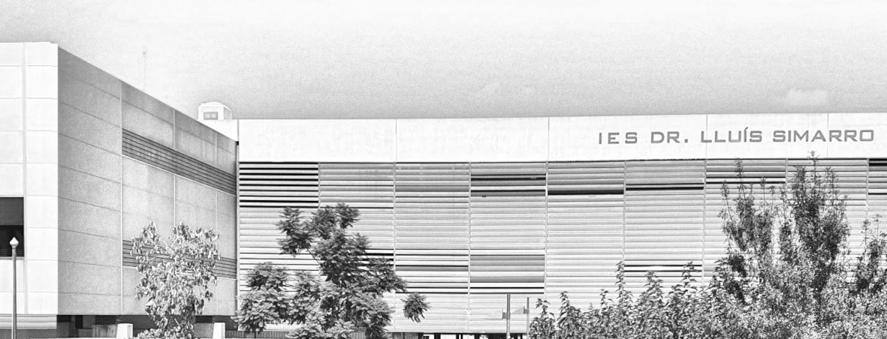

# 🏛️ IES Dr. Lluís Simarro: Infraestructura Soberana de IA (PP1)

## 📖 Visión General

Este repositorio gestiona la infraestructura de **Inteligencia Artificial Soberana** del IES Dr. Lluís Simarro (Centro de Excelencia 2025). 

A diferencia de las implementaciones estándar en la nube, nuestra arquitectura opera sobre un **Centro de Procesamiento de Datos (CPD) local de alto rendimiento**, diseñado para garantizar la privacidad de los datos educativos y eliminar la latencia en el aula.

El sistema orquesta contenedores Docker optimizados para dos funciones críticas:
1.  **Creación de datasets sintéticos, entrenamiento y Fine-Tuning masivo** (Nodo Titán).
2.  **Inferencia de baja latencia y alta concurrencia** (Array de Dual-Spark).

---

## 🏗️ Infraestructura de Hardware (Specs)

El código de este repositorio está ajustado para explotar la siguiente topología física:

### 🧠 1. Nodo "Titán" (Entrenamiento y Gestión de Datos)
*El cerebro central para la generación de datasets sintéticos y re-entrenamiento de modelos.*
* **CPU:** AMD Ryzen Threadripper PRO 9995WX (Arquitectura Zen 5, 96 Núcleos / 192 Hilos).
* **GPU:** 3x **NVIDIA RTX 6000 PRO Max-Q**.
    * Total VRAM: **288 GB** (96 GB por tarjeta).
* **Memoria RAM:** 512 GB DDR5 ECC (Octa-Channel).
* **Almacenamiento:** 32 TB NVMe PCIe 5.0 (RAID 10) para datasets masivos y modelos (16TB netos).

### ⚡ 2. Array "Spark" (Inferencia Distribuida)
*Cluster de inferencia lógica para los asistentes del alumnado y RAGs departamentales.*
* **Nodos Físicos:** 6x Unidades NVIDIA DGX Spark (Superchip NVIDIA GB10 Grace Blackwell).
* **Arquitectura de Memoria Unificada:**
    * Los nodos operan en **Pares Lógicos** (Spark Pair 01-03) conectados por fibra óptica directa a 200Gb/s.
    * **Capacidad por Par:** 256 GB de Memoria Coherente (128GB + 128GB).
    * **Capacidad de Modelo:** Ejecución de modelos de hasta **405B parámetros** (ej. Llama-3.1-405B).
* **Rendimiento:** Hasta 1 PetaFLOP AI (FP4) por unidad.

---

## 💡 Contribuir

¿Te gustaría contribuir a este repositorio? ¡Excelente! Las Pull Requests son bienvenidas. Se aceptaran todo tipo de configuraciones y aportaciones relacionadas con el proyecto y sobre el hardware específico utilizado en el proyecto.

